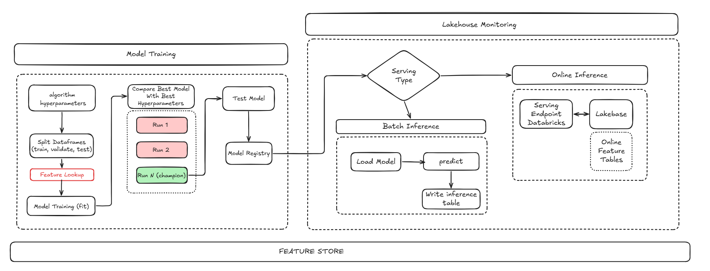

# mlops-platform

Workflows reutilizáveis e decisões de arquitetura do ecossistema de ML no Databricks.

Três repositórios compõem o ecossistema:

| repositório | papel |
|---|---|
| [`platform-libs`](https://github.com/ViniciusOtoni/platform-libs) | o framework `mlplatform`, publicado como wheel em release |
| `mlops-platform` | esteiras de CI/CD compartilhadas e esta documentação |
| [`exemplo-domain`](https://github.com/ViniciusOtoni/exemplo-domain) | domínio consumidor, com cinco bundles |

## O problema

Um pipeline de ML tem cinco componentes: gerar features, treinar, registrar, servir e monitorar. Nenhum é difícil. O custo aparece quando cada domínio reimplementa os cinco.

O que acontece sem plataforma:

A mesma feature table é escrita de três jeitos diferentes, com regras próprias de janela, chave e modo de escrita. A lógica de split, de gate de qualidade e de promoção de modelo vive dentro de notebooks, onde não há teste. Serving batch e online são construídos separadamente e divergem. O monitoramento, quando existe, é um notebook agendado que ninguém abre.

O sintoma mais caro é o silencioso: a implementação de um domínio tem um defeito que o outro não tem, e ninguém descobre até a decisão errada já ter sido tomada.

## Como a proposta resolve

Um pacote Python único, consumido por todos os domínios. O domínio declara o que é específico dele; o framework executa o resto.

**Ports e adapters.** A lógica de domínio (janela, split, gate, seleção de modelo) não conhece Spark, MLflow nem o SDK do Databricks. Ela conversa com protocolos, e as implementações reais ficam nos adapters. Isso torna a lógica testável sem cluster: a suíte roda em segundos, num processo local.

```python
class FeatureWriter(Protocol):
    def write(self, df, table_name, entity_keys, timestamp_key, mode, ...): ...
```

**Contrato declarativo por componente.** Cada componente tem uma dataclass que o domínio preenche. A validação acontece no import, não em runtime dentro do job.

```python
@dataclass
class MonitoringConfig:
    domain: str
    model_name: str
    target_table: str
    columns: list[str]
    threshold: float
    drift_metric: str = "population_stability_index"
```

**Descoberta por entry point.** O domínio declara um entry point no grupo `mlplatform.domains`. O framework carrega o módulo, e o import registra as configs por efeito colateral. Nenhum caminho de arquivo hardcoded.

```toml
[project.entry-points."mlplatform.domains"]
credito_features = "credito_features.configs"
```

**Bundle gerado em CI.** O domínio não versiona `databricks.yml` nem `resources/`. A esteira roda `mlp-generate-bundle`, que lê um `conf/variables.yml` de três linhas e materializa o bundle inteiro. O gerado é efêmero, o que elimina a divergência entre o que está no repositório e o que está deployado.

## Como implementamos



### O framework

```
mlplatform/
├── core/          registry, auditoria, naming, geração de bundle, grants
├── features/      contrato, janela, qualidade, escrita Delta, Lakebase
├── training/      split, pipeline, seleção, pyfunc, registro no UC
├── serving/       batch, endpoint online, estrutura da tabela de saída
├── monitoring/    drift, baseline, gatilho de retreino
├── entrypoints.py console scripts (composition root)
└── testing.py     fakes publicados, para os domínios testarem
```

Cada contexto tem `contract.py` (o que o domínio declara), `ports.py` (protocolos), `adapters.py` (implementações reais), `usecases.py` (a lógica) e `resource_gen.py` (o YAML do job).

Os fakes são publicados em `testing.py` de propósito. Sem isso, cada domínio escreveria os seus, e um fake permissivo esconde bug: o fake de tracking de experimento, por exemplo, rejeita reescrita de parâmetro porque o MLflow real rejeita.

### As esteiras

| workflow | quando roda | o que faz |
|---|---|---|
| `ci-validate` | abertura e push de PR | testes, ruff, gate de versão, `bundle validate` |
| `deploy-bundle` | merge na `main` | gera o bundle e deploya |
| `release-package` | merge na `main` do framework | cria tag, release e anexa o wheel |
| `retrain-on-drift` | `repository_dispatch` do job de drift | retreina sem promover, e registra o candidato |
| `promote-model` | disparo manual | move o alias para a versão aprovada |

O framework é entregue aos jobs pela URL do wheel de release, dentro do Environment nativo do serverless. Não há init script, não há venv empacotada, não há passo manual.

### Retreino disparado por drift

```
Databricks detecta drift
   └─ repository_dispatch no repositório do domínio
        └─ retrain: treina com promotion_alias=none e fixa a versão candidata
             └─ uma pessoa compara as runs no MLflow
                  └─ promote-model: move o alias
```

A separação em dois workflows é deliberada. Drift indica que o mundo mudou, não que o modelo novo é melhor: ele pode ter treinado sobre o mesmo dado deslocado e aprendido o deslocamento. Promover automaticamente trocaria um modelo defasado por um desconhecido.

A promoção usa `workflow_dispatch` em vez de um job guardado por `environment:`. O motivo é prático: "required reviewers" em Environment é recurso de plano. Num repositório privado de conta gratuita, a API recusa a regra com 422 e o Environment é criado sem proteção alguma. Um job guardado por ele passaria direto, e o gate seria decorativo, o que é pior do que não ter gate. O `environment:` continua declarado, e volta a somar proteção quando o plano permitir.

A versão candidata é fixada no retreino e passada adiante como output. Resolver "a mais recente" na hora da promoção correria o risco de promover outra versão, caso um treino agendado tivesse rodado no intervalo.

### Contratos de import

O artefato do MLflow embarca o módulo pyfunc via `code_paths`, e o MLflow o importa dentro do container do endpoint de serving, onde pyspark, delta e o SDK não existem. Um import de infraestrutura no topo quebraria produção sem nenhum teste reclamar.

Dois testes guardam isso: um verifica que `import mlplatform` não puxa infraestrutura transitivamente; outro verifica que o módulo embarcado não importa nada além do que o container tem.

Há também um teste que compara os job parameters de cada gerador com o que os parsers dos entrypoints aceitam. O Databricks injeta todo job parameter em todas as tasks do job, e um argumento não declarado aborta com `SystemExit(2)`, sem dizer qual.

## Ganhos

O que a plataforma passa a garantir por construção, e a evidência medida no domínio de crédito.

| garantia | como | evidência |
|---|---|---|
| feature store com histórico | backfill particionado pela coluna de tempo | 24 safras, 720 mil linhas |
| sem vazamento temporal | `FeatureLookup` com `timestamp_lookup_key` | AUC de teste 0,7631, faixa esperada |
| avaliação honesta | split temporal, corte sempre sobre safra real | queda de 0,7862 na validação para 0,7631 no teste |
| modelo rastreável | registro via Feature Engineering, com linhagem | serving resolve features sem o domínio informá-las |
| dois modos de serving | mesma linhagem, dois adapters | 30 mil pontuados em lote; endpoint respondendo por chave |
| drift com causa | baseline na janela de treino | PSI de 5,26 em atraso comportamental, limiar 0,25 |
| nada promovido sem revisão | retreino separado da promoção | candidato registrado, alias parado até aprovação |

O ciclo completo foi executado no workspace, não apenas deployado.

## Comparação com outras plataformas

| plataforma | abordagem | o que o time de domínio escreve |
|---|---|---|
| Michelangelo (Uber) | plataforma proprietária de ponta a ponta | configuração dentro da plataforma |
| Metaflow (Netflix) | biblioteca de fluxo, infraestrutura plugável | o fluxo inteiro, como código Python |
| Bighead (Airbnb) | serviços integrados (Zipline, Redspot, Deep Thought) | integração com cada serviço |
| FBLearner (Meta) | fluxo padronizado com reuso entre times | o operador, dentro do fluxo |
| Databricks nativo | Feature Engineering, MLflow, Lakehouse Monitoring, DABs | a cola entre os componentes |
| este ecossistema | framework único sobre o nativo | só o contrato do domínio |

O eixo da comparação é a última coluna.

Metaflow entrega liberdade e pede que cada time escreva o fluxo, o que funciona bem quando os times são maduros e os problemas, distintos. Michelangelo padroniza forte e pede que o time trabalhe dentro da plataforma, o que funciona em escala e custa flexibilidade.

A escolha aqui foi diferente das duas: o Databricks já entrega feature store, registro, serving e monitoramento. Reimplementar seria desperdício. O que faltava era a camada que liga essas peças com uma decisão só por assunto, para que dois domínios não resolvam a mesma coisa de dois jeitos.

Isso tem um limite conhecido: o framework é acoplado ao Databricks. Trocar de nuvem significaria reescrever os adapters. A troca foi aceita deliberadamente, porque a alternativa (abstrair a nuvem) custa complexidade em toda decisão e paga apenas num cenário de migração que pode nunca acontecer.

## Como um repositório consome as esteiras

```yaml
# .github/workflows/deploy.yml
name: Deploy

on:
  push:
    branches: [main]

jobs:
  deploy:
    strategy:
      matrix:
        component: [features, training, serving/batch, serving/online, monitoring]
    uses: ViniciusOtoni/mlops-platform/.github/workflows/deploy-bundle.yml@main
    with:
      working-directory: ${{ matrix.component }}
    secrets: inherit
```

Cada repositório chamador precisa dos próprios secrets `DATABRICKS_HOST` e `DATABRICKS_TOKEN`. Contas pessoais do GitHub não compartilham secrets entre repositórios.

O design completo está em [`docs/superpowers/specs/2026-08-23-arquitetura-plataforma-design.md`](docs/superpowers/specs/2026-08-23-arquitetura-plataforma-design.md).
