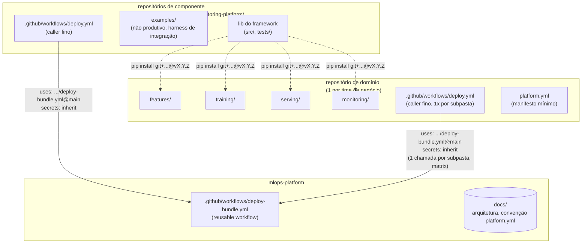

# Design: Arquitetura de Plataforma — Separação Framework/Domínio e GitOps Compartilhado

## 1. Contexto

Os quatro componentes do ecossistema (`feature-platform`, `training-platform`,
`serving-platform`, `monitoring-platform`) foram desenhados e planejados com uma
decisão de estágio explícita, repetida em cada um: "monorepo por enquanto — lib e
pasta de domínio de exemplo no mesmo repositório — migrar para multi-repo quando
houver necessidade real". Essa necessidade chegou antes da primeira implementação: o
usuário quer, desde já, que qualquer domínio de negócio consuma os quatro componentes
"independente do dado, modelo a ser criado e regra de negócio", com governança e
padronização de processos entre domínios.

Isso exige duas coisas que nenhum dos quatro specs cobria: uma separação real entre
**código de framework** (o que os quatro repositórios de componente produzem) e
**código de domínio** (o que cada time de negócio escreve para consumir os
frameworks), e uma forma de não duplicar CI idêntica entre um número crescente de
repositórios — de componente e de domínio.

Este spec cobre a arquitetura que resolve as duas coisas. Ele foi desenhado via
interview em rounds (skill `grilling`), e sua aprovação implicou emendar os quatro
specs e planos já escritos — cada emenda está documentada no próprio repositório
afetado, não duplicada aqui.

## 2. Escopo

**Dentro do escopo:**
- Definição do papel deste repositório (`mlops-platform`): hospedar o *reusable
  workflow* de CI compartilhado e a documentação de arquitetura cross-cutting.
- Contrato do reusable workflow (inputs, secrets, comportamento).
- Convenção de repositório de domínio (estrutura, manifesto `platform.yml`, forma de
  consumir os pacotes-framework).
- Estratégia de versionamento dos quatro pacotes-framework.

**Fora do escopo (decisão explícita):**
- **Composite actions.** Um reusable workflow único já cobre o padrão real de uso
  (autenticar + validar + deployar, sempre juntos); introduzir um segundo mecanismo de
  reuso sem um caso de uso que precise de granularidade menor é complexidade
  antecipada.
- **Publicação em índice de pacotes** (GitHub Packages ou similar). `pip install
  git+https://...@tag` já dá versionamento real sem infraestrutura adicional.
- **Versionamento automatizado** (semantic-release, conventional commits). Decisão
  manual de quando cortar uma tag é apropriada para um mantenedor solo; automação fica
  para quando o volume de releases justificar.
- **Enforcement automatizado do `platform.yml`.** A convenção existe desde o primeiro
  repositório de domínio; um CI check que a valida fica para quando houver mais de um
  domínio real e sinal de que o manifesto diverge na prática.
- **Repositório de exemplo de domínio vivo** (`platform-example-domain`). Cada
  componente mantém sua própria pasta `examples/` interna, suficiente para testar o
  framework isoladamente; um repo de referência viva fica para quando o primeiro
  domínio real existir.

## 3. Arquitetura geral



## 4. Reusable workflow (`deploy-bundle.yml`)

Único mecanismo de reuso de CI (decisão explícita: sem composite actions, seção 2).
Opera sobre **um bundle DAB por vez** — quem chama decide quantas vezes invocar (um
job por bundle, via `strategy: matrix` nativo do GitHub Actions), mantendo o workflow
reutilizável simples e genérico.

```yaml
# .github/workflows/deploy-bundle.yml (em mlops-platform)
name: Deploy Bundle (reusable)

on:
  workflow_call:
    inputs:
      working-directory:
        description: Caminho do bundle DAB dentro do repositório chamador.
        required: true
        type: string
      bundle-target:
        description: Target do bundle (dev, prod, etc.).
        required: false
        type: string
        default: dev
      python-version:
        required: false
        type: string
        default: "3.11"

jobs:
  deploy:
    runs-on: ubuntu-latest
    defaults:
      run:
        working-directory: ${{ inputs.working-directory }}
    steps:
      - uses: actions/checkout@v4

      - name: Set up Python
        uses: actions/setup-python@v5
        with:
          python-version: ${{ inputs.python-version }}

      - name: Install dev dependencies
        run: pip install -r requirements-dev.txt

      - name: Run unit tests
        run: pytest

      - name: Generate resources (if this bundle has a generator)
        run: |
          if [ -f scripts/generate_resources.py ]; then
            python scripts/generate_resources.py
          else
            echo "no scripts/generate_resources.py — skipping"
          fi

      - name: Install Databricks CLI
        uses: databricks/setup-cli@main

      - name: Deploy bundle
        env:
          DATABRICKS_HOST: ${{ secrets.DATABRICKS_HOST }}
          DATABRICKS_TOKEN: ${{ secrets.DATABRICKS_TOKEN }}
        run: |
          databricks bundle deploy -t ${{ inputs.bundle-target }} \
            --var="git_commit=${{ github.sha }}" \
            --var="git_branch=${{ github.ref_name }}"
```

`${{ github.sha }}` e `${{ github.ref_name }}` dentro de um reusable workflow refletem
o evento do repositório **chamador** (o run inteiro é uma única execução de workflow,
só delegando um job) — não precisam ser passados como input explícito.

**Secrets**: o repositório chamador declara `secrets: inherit` na chamada, o que
propaga os secrets do **próprio repositório chamador** (não do `mlops-platform`) para
dentro do job. Como a conta do usuário é pessoal (não uma organização GitHub), não
existe secret compartilhado automaticamente entre repositórios — cada repositório
(framework ou domínio) precisa ter sua própria cópia de `DATABRICKS_HOST` e
`DATABRICKS_TOKEN` configurada. Isso é uma limitação conhecida da conta pessoal, não
do design do reusable workflow, e está documentada como tal (seção 7).

**Como um repositório chamador usa isso** (exemplo, um repositório de componente):

```yaml
# .github/workflows/deploy.yml (em cada repositório de componente ou de domínio)
name: Deploy

on:
  push:
    branches: [main]

jobs:
  deploy:
    uses: ViniciusOtoni/mlops-platform/.github/workflows/deploy-bundle.yml@main
    with:
      working-directory: .
    secrets: inherit
```

Um repositório de domínio com múltiplas subpastas (Q4 da decisão de arquitetura) chama
o mesmo reusable workflow uma vez por subpasta, via matrix:

```yaml
# .github/workflows/deploy.yml (em um repositório de domínio, múltiplos componentes)
name: Deploy

on:
  push:
    branches: [main]

jobs:
  deploy:
    strategy:
      matrix:
        component: [features, training, serving, monitoring]
    uses: ViniciusOtoni/mlops-platform/.github/workflows/deploy-bundle.yml@main
    with:
      working-directory: ${{ matrix.component }}
    secrets: inherit
```

## 5. Convenção de repositório de domínio

Um repositório por domínio de negócio, cobrindo todos os componentes que aquele
domínio usa (não precisa ser os quatro). Estrutura:

```
<dominio>/
├── features/           # se o domínio usa o Componente 1
│   ├── databricks.yml
│   ├── requirements-dev.txt
│   ├── <módulos com @feature_table>
│   └── ...
├── training/            # se usa o Componente 2
├── serving/              # se usa o Componente 3
├── monitoring/           # se usa o Componente 4
├── platform.yml
└── .github/workflows/deploy.yml
```

Cada subpasta é independente: seu próprio `databricks.yml`, seu próprio
`requirements-dev.txt` (declarando a dependência do pacote-framework correspondente,
pinada), seu próprio ciclo de deploy.

**`platform.yml`** — manifesto mínimo, sem enforcement automatizado no v1 (decisão
explícita, seção 2), só convenção documentada desde o primeiro domínio:

```yaml
domain: credito
owner: time-risco-credito
components:
  features:
    package: feature-platform
    version: v0.1.0
  training:
    package: training-platform
    version: v0.1.0
```

**Instalação dos pacotes**: cada `requirements-dev.txt` (ou `pyproject.toml`) de
domínio referencia o pacote correspondente via git, pinado numa tag:

```
feature-platform @ git+https://github.com/ViniciusOtoni/feature-platform@v0.1.0
```

## 6. Versionamento dos pacotes-framework

Manual. O mantenedor de cada um dos quatro repositórios de componente cria uma tag
semver (`git tag v0.1.0 && git push --tags`) quando decide que o estado atual da
`main` está pronto para ser consumido por um domínio. Não há workflow de release
automatizado — decisão explícita (seção 2). Cada domínio referencia a tag exata da
versão que testou, e atualiza deliberadamente quando quiser adotar uma nova.

## 7. Riscos e restrições conhecidas

| Risco | Situação |
|---|---|
| Conta pessoal do GitHub não compartilha secrets entre repositórios automaticamente (diferente de uma Organization) | Cada repositório (framework ou domínio) precisa da sua própria cópia de `DATABRICKS_HOST`/`DATABRICKS_TOKEN`. Sem mitigação automatizada no v1 — documentado como processo manual de setup por repositório. |
| `secrets: inherit` em reusable workflow entre repositórios distintos | **Confirmado ao vivo (2026-08-24).** PR do `feature-platform` mergeado disparou `Deploy` de verdade contra `mlops-platform@main`: `workflow_call` resolveu, todos os steps até `Install Databricks CLI` passaram. Único ponto de falha (esperado, sem relação com este risco): `feature-platform` ainda não tem `DATABRICKS_HOST`/`DATABRICKS_TOKEN` configurados como secrets do repositório — ver o risco acima, item de setup manual pendente. |
| Múltiplos bundles por matrix, mesmo repositório | Cada entrada do matrix roda como um job independente; falhas isoladas por subpasta não bloqueiam as demais por padrão do GitHub Actions — comportamento esperado, não uma limitação. |

## 8. Testes

Este repositório não tem pacote Python — não há suíte `pytest` própria. A verificação
de que o reusable workflow funciona acontece organicamente: cada repositório de
componente (já emendado para chamá-lo) o exercita a cada push na `main`. A primeira
execução real de CI de qualquer um dos quatro repositórios, após a emenda, é a
verificação de fato deste design.

## 9. Relação com os quatro componentes já existentes

Cada um dos quatro repositórios (`feature-platform`, `training-platform`,
`serving-platform`, `monitoring-platform`) foi emendado para refletir esta arquitetura:
a pasta `dominios/exemplo/` foi renomeada para `examples/` (não representa mais "onde
domínios reais vivem", só o harness de teste de integração do próprio framework), e o
`.github/workflows/deploy.yml` de cada um passou a ser um caller fino deste reusable
workflow. Os detalhes de cada emenda estão documentados no spec de cada repositório
afetado, seção "Emenda".

---

## 10. Emenda (2026-08-26) — consolidação num framework único

As seções 1–9 descrevem uma arquitetura de **quatro pacotes-framework em quatro
repositórios**. Isso deixou de valer. Esta emenda registra o que mudou e por quê;
o texto acima fica como registro histórico da decisão anterior, não como descrição
do estado atual.

### O que mudou

Os quatro componentes viraram **um pacote só, `mlplatform`**, com um módulo por
bounded context (`features`, `training`, `serving`, `monitoring`) e um shared
kernel em `core/`. Os quatro repositórios foram apagados; todo o histórico está
preservado no `platform-libs`, que passou a hospedar o pacote único.

### Por quê

A separação em quatro repositórios resolvia um problema real — versionamento
independente por componente — mas cobrava um preço que só ficou visível depois de
o ecossistema rodar ponta a ponta:

- **Duplicação que divergiu em silêncio.** `Finding` existia em três cópias com
  campos diferentes. O helper de Environment existia em três cópias, e a de
  monitoring tinha um bug (aplicava a chave só em `tasks[0]`) que as outras não
  tinham. Ninguém percebeu porque nenhum code review olhava os três repositórios
  ao mesmo tempo.
- **Regra de plataforma vazando para o domínio.** A convenção
  `{catalog}.{domain}_models.{model}` estava hardcodada em seis lugares, incluindo
  scripts do repositório de domínio.
- **Acoplamento sem validação possível.** `FeatureLookupSpec.table_name` é uma
  string que precisa bater com o nome derivado de uma `@feature_table` registrada
  em *outro* repositório. Com quatro pacotes, nada podia verificar isso. Com um
  só, os dois registries carregam no mesmo processo e a checagem passa a existir.

### O que se perdeu, e como foi compensado

O isolamento de blast radius: antes, um release ruim de `feature-platform` não
podia derrubar o deploy de serving, porque eram versões independentes. Agora uma
versão de `mlplatform` cobre os quatro. A compensação é pin **exato** por bundle
(`@mlplatform-vX.Y.Z`, nunca range), preservando a capacidade de cada bundle do
domínio subir em momento diferente.

### O contrato que substitui a fronteira física

Com quatro repositórios, o acoplamento entre contextos era impossível por
construção. Num pacote só, ele custa um import. O `ruff.toml` deste repositório
passa a impor, em CI, que os bounded contexts não se importem entre si e que o
`core/` não importe contexto nenhum — ver a seção correspondente no README.
